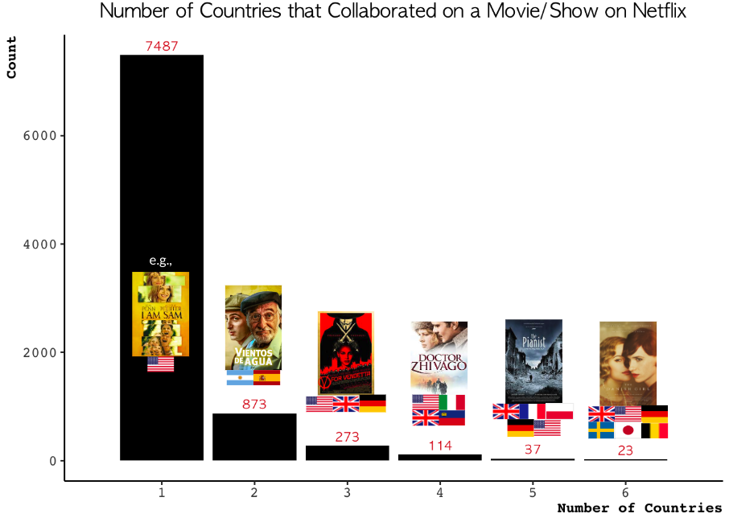
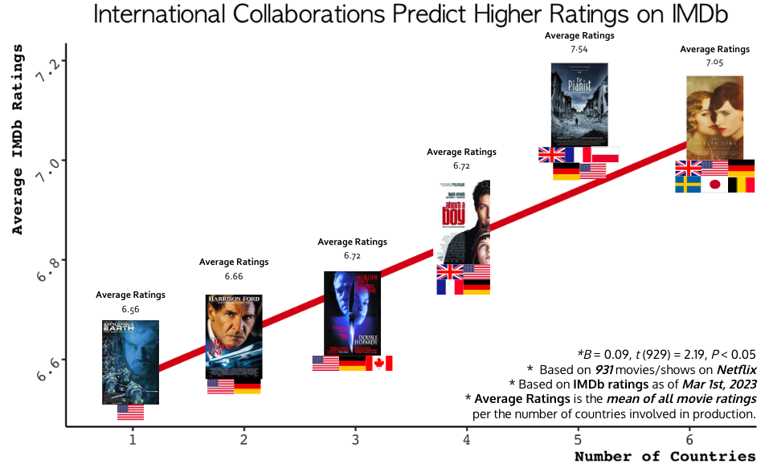
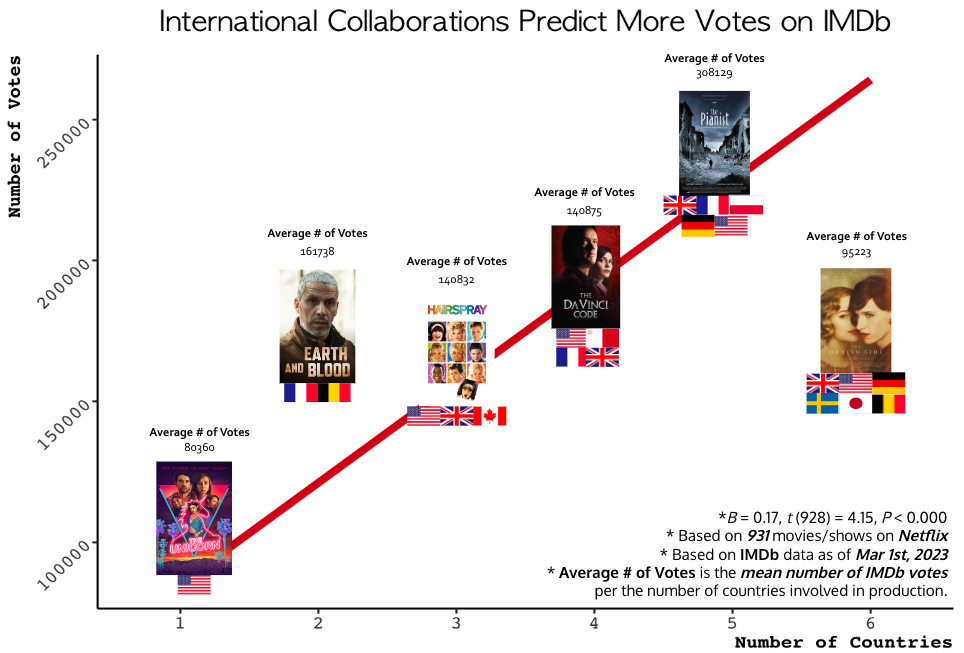
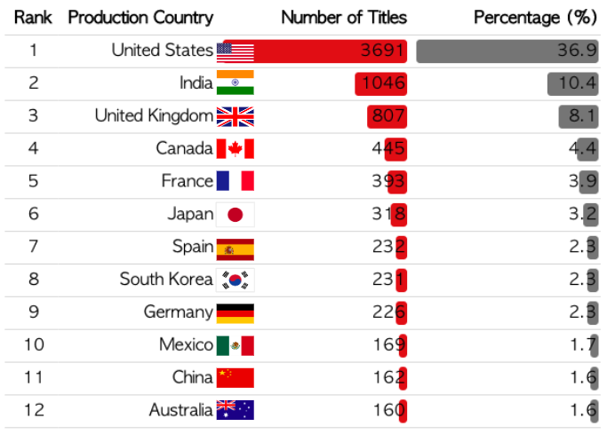

# Does International Collaboration Impact IMDB Ratings? (Focus on Netflix)

For the project summary, visit [Project Summary]().

* Overview

This project investigates the impact of international collaboration on IMDb ratings, focusing on Netflix content. The study analyzes whether movies and shows produced by multiple countries receive higher IMDb ratings and explores the relationship between these ratings and Netflix's financial performance.

* Key Findings:
  * Titles produced by multiple countries tend to have higher IMDb ratings and more votes, indicating broader global appeal.
  
  
  

  * Netflix Originals are mostly produced by the U.S., but international collaborations still occur.
  

  * IMDb ratings for Netflix Originals have been declining, despite Netflix's growing revenue and subscriber base.

* Dataset
  - Netflix Data: [Kaggle](https://www.kaggle.com/datasets/shivamb/netflix-shows)
  - Netflix Original Data: [Kaggle](https://www.kaggle.com/datasets/luiscorter/netflix-original-films-imdb-scores)
  - IMDB Data: [IMDB Interfaces](https://www.imdb.com/interfaces/)
  - Financial Statistics: [Business of Apps](https://www.businessofapps.com/data/netflix-statistics/)
  
*Note: Data is based on titles available on Netflix as of mid-2021.*

* Next Steps:
  * Explore alternative metrics to assess user experience.
  * Use text mining on reviews to understand the decline in IMDb ratings.
  * Investigate the role of international collaborations in shaping viewer perceptions over time.
